<div align="center">

# 🧠 StudyMind
### AI-Powered Study Assistant

**Upload your notes. Get AI summaries. Chat with your documents. Quiz yourself.**

[](https://reactjs.org/)
[](https://nodejs.org/)
[](https://mysql.com/)
[](https://tailwindcss.com/)
[](https://groq.com/)

</div>

---

## 📌 Overview

StudyMind is a full-stack SaaS web application that transforms uploaded study documents into AI-generated summaries, interactive quizzes, and context-aware conversations — powered by LLaMA 3 via Groq and a RAG (Retrieval-Augmented Generation) pipeline.

---

## ✅ Features

| Feature | Description |
|---------|-------------|
| 🔐 Authentication | JWT-based login & register with bcrypt |
| 📂 Notes Upload | PDF & TXT file upload with text extraction |
| 🧠 AI Summary | Instant AI summaries from your documents |
| 💬 AI Chat | RAG-based Q&A grounded in your notes |
| 🧪 Quiz Generator | Auto MCQ generation with instant scoring |
| 👤 User Profile | Account, security & preference management |
| 🔍 Search | Live search across all uploaded notes |

---

## 📸 Screenshots

### Landing Page
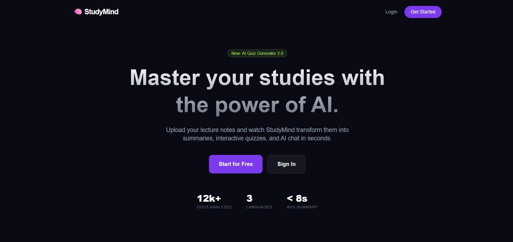
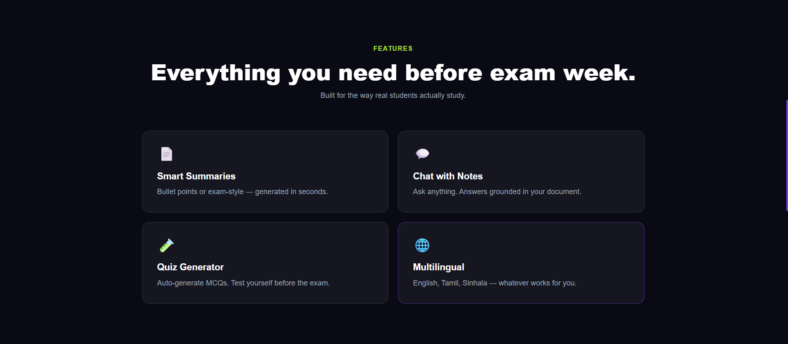
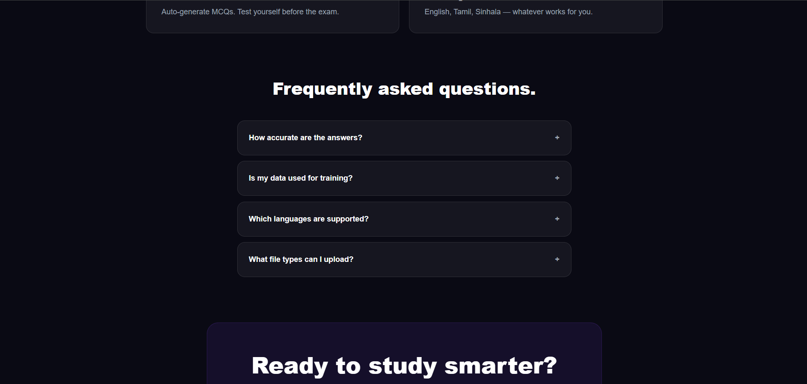
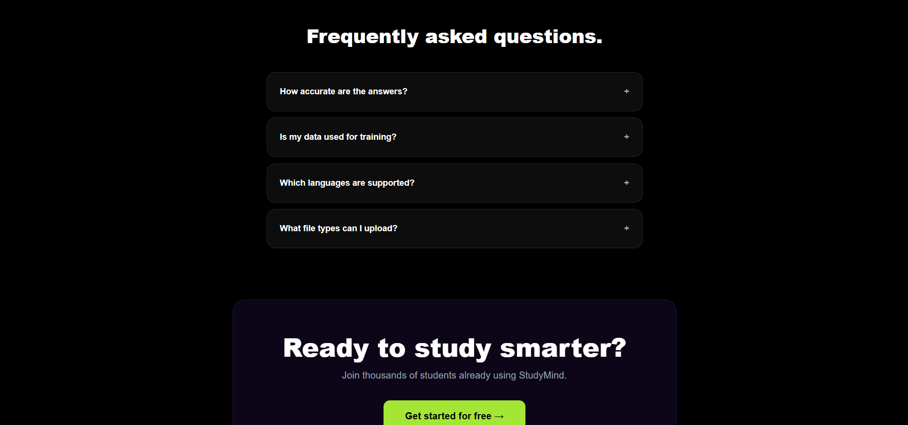
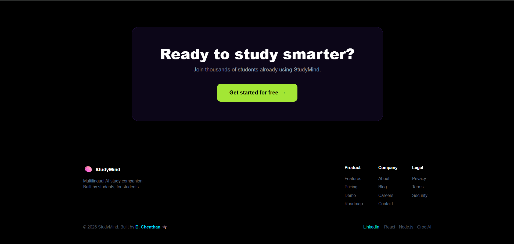

### Authentication
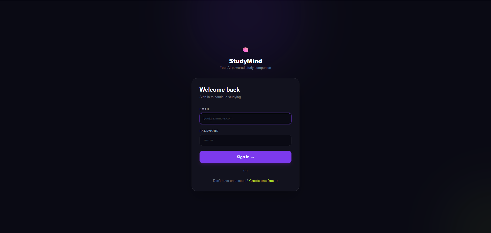
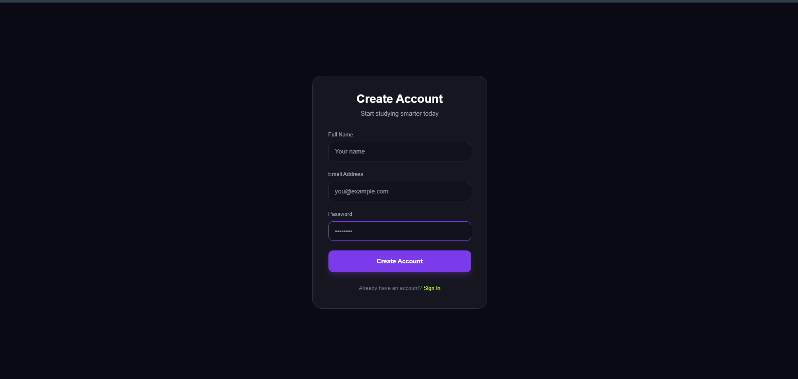

### Dashboard
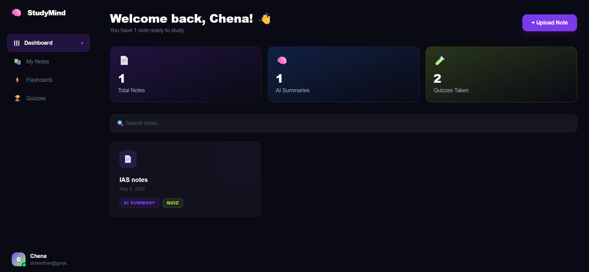
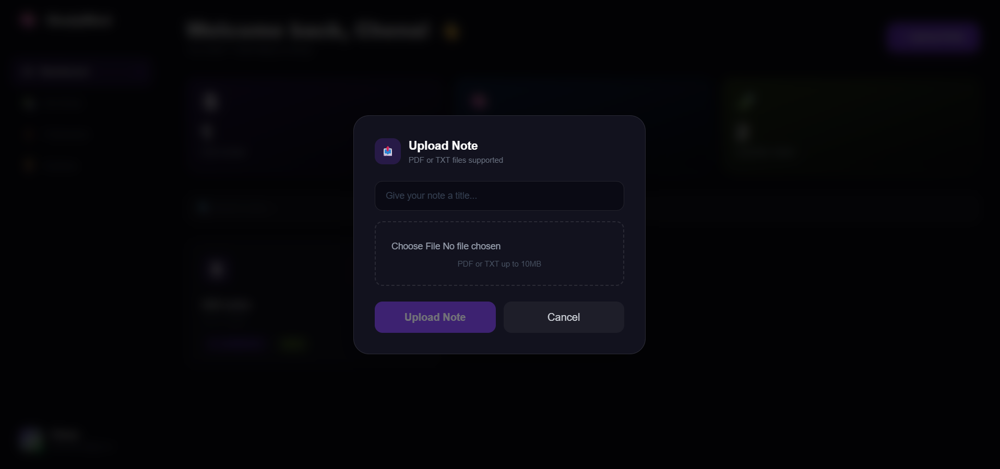
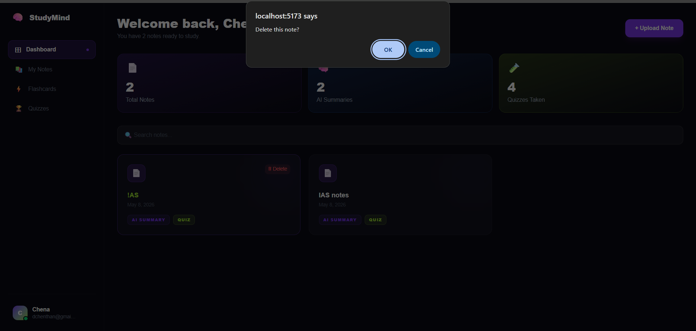

### AI Features
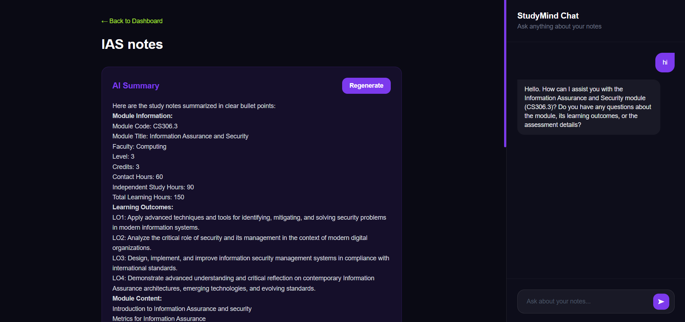


### Quiz


### Profile
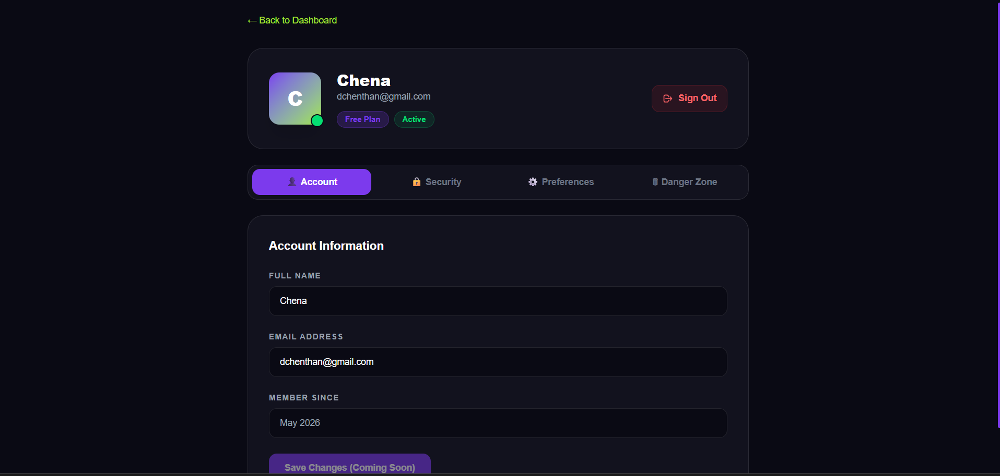


---

## 🛠 Tech Stack

### Frontend
- React 18 + Vite
- Tailwind CSS
- React Router DOM
- Axios

### Backend
- Node.js + Express.js
- MySQL 8 + mysql2
- JWT Authentication
- Bcrypt.js
- Multer + pdf-parse

### AI
- Groq API (LLaMA 3.3 70B)
- RAG Architecture

---

## 📁 Project Structure

```
studymind/
├── client/
│   └── src/
│       ├── pages/
│       │   ├── Landing.jsx
│       │   ├── Login.jsx
│       │   ├── Register.jsx
│       │   ├── Dashboard.jsx
│       │   ├── NotePage.jsx
│       │   └── Profile.jsx
│       ├── services/
│       │   └── api.js
│       └── App.jsx
│
└── server/
    ├── controllers/
    │   ├── authController.js
    │   ├── noteController.js
    │   └── chatController.js
    ├── routes/
    │   ├── auth.js
    │   ├── notes.js
    │   └── chat.js
    ├── middleware/
    │   └── auth.js
    ├── utils/
    │   └── aiService.js
    ├── db.js
    └── app.js
```

---

## 🗃 Database

MySQL relational database with 4 core tables — `users`, `notes`, `chats`, and `messages` — structured to support user-scoped data, file metadata, and persistent chat history.

---

## 🚀 Getting Started

### Prerequisites
- Node.js v18+
- MySQL 8.0
- Groq API Key → [console.groq.com](https://console.groq.com)

### Backend Setup
```bash
cd server
npm install
```

Create `server/.env`:
```env
PORT=5000
DB_HOST=localhost
DB_USER=root
DB_PASSWORD=your_password
DB_NAME=ai_study_assistant
JWT_SECRET=your_secret
GROQ_API_KEY=your_groq_key
```

```bash
npm run dev
```

### Frontend Setup
```bash
cd client
npm install
npm run dev
```

Open `http://localhost:5173`

---

## 📡 API Reference

RESTful API built with Express.js. All protected routes require a Bearer JWT token in the Authorization header.

Core modules: **Auth** · **Notes** · **AI Summary** · **Quiz** · **Chat**

---

## 🧠 AI Pipeline (RAG)

```
User uploads PDF/TXT
       ↓
Text extracted → stored in MySQL
       ↓
User sends query
       ↓
Note text retrieved from DB
       ↓
Context + Query → Groq (LLaMA 3.3 70B)
       ↓
Grounded response → saved + displayed
```

---

## 🔐 Security

- Passwords hashed with **bcrypt** (10 salt rounds)
- **JWT tokens** expire in 7 days
- All routes protected with auth middleware
- Users can only access their own data

---

## 📄 License & Copyright

```
Copyright © 2026 D. Chenthan. All Rights Reserved.

This project and all its contents are the intellectual property of D. Chenthan.
Unauthorized copying, modification, distribution, or use of this project
in any form is strictly prohibited without explicit written permission.

This repository is published for portfolio and demonstration purposes only.
```

---

<div align="center">

**Built by D. Chenthan**

Software Engineering Undergraduate · NSBM Green University · Sri Lanka 🇱🇰

[](https://www.linkedin.com/in/d-chenthan-25018535b)
[](https://github.com/Chenthan006)

*© 2026 D. Chenthan · All Rights Reserved*

</div>
